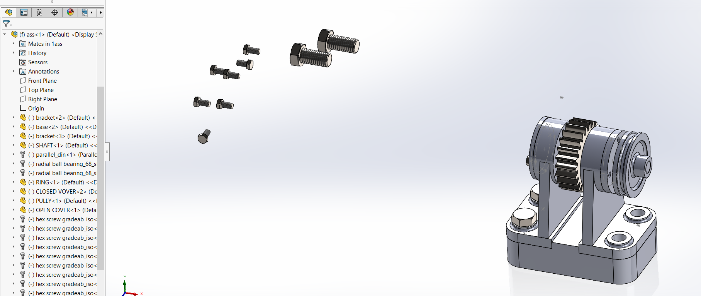
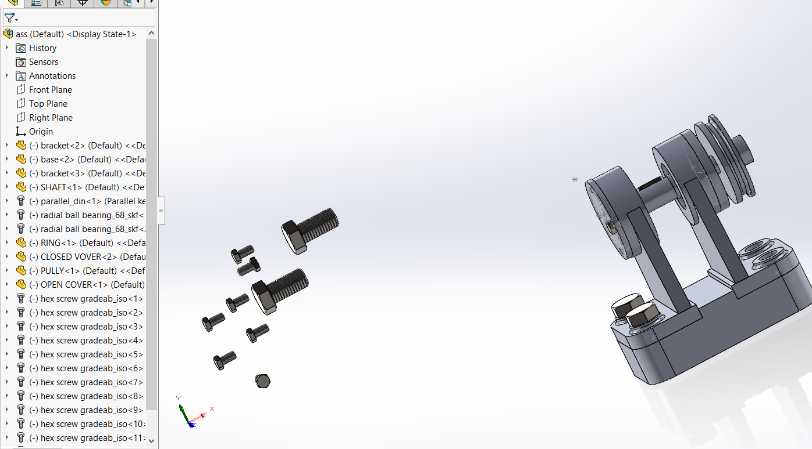

# Mechanical Gear Drive Assembly

A 3D mechanical CAD project featuring the design and assembly of a mechanical gear drive system developed using **SOLIDWORKS**.

The assembly integrates a spur gear, shaft, pulley, bearings, support brackets, covers, base structure, and standard fastening components into a complete mechanical drive assembly.

---

## Project Overview

This project focuses on the modeling and assembly of a mechanical power transmission system using SOLIDWORKS.

Individual mechanical components were modeled as separate parts and integrated into a complete assembly using mechanical mates and standard hardware.

The design demonstrates practical CAD skills in part modeling, assembly design, shaft-supported rotating components, and mechanical component integration.

---

## Main Components

- Spur gear
- Shaft
- Pulley
- Radial ball bearings
- Support brackets
- Base structure
- Open and closed covers
- Retaining ring
- Bolts and standard fasteners
- Complete mechanical assembly

---

## CAD Model & Assembly

### Front Assembly View



This view shows the main mechanical drive assembly, including the spur gear, shaft, pulley, support brackets, bearings, base structure, and fastening components.

### Rear Assembly View



This view highlights the rear side of the assembly, showing the shaft support arrangement, pulley positioning, bearing locations, structural brackets, and mounting hardware.

---

## Mechanical Design Features

The assembly demonstrates several important mechanical design concepts:

- Shaft-supported rotating components
- Spur gear integration
- Pulley integration
- Bearing-supported shaft design
- Structural support using brackets
- Mechanical fastening using bolts and standard hardware
- Multi-component assembly integration

---

## CAD Workflow

The project was developed using a component-based mechanical CAD workflow:

1. Individual mechanical components were modeled as separate SOLIDWORKS parts.
2. The base and supporting brackets were created to provide the structural framework.
3. The shaft, spur gear, pulley, covers, and retaining components were integrated into the design.
4. Bearings and standard fastening components were incorporated into the assembly.
5. Assembly mates were used to position and constrain the individual components.
6. The complete assembly was reviewed as an integrated mechanical system.

---

## Project Structure

```text
mechanical-gear-drive-solidworks/
│
├── assets/
│   ├── gear_drive_front_view.png
│   └── gear_drive_rear_view.png
│
├── solidworks-files/
│   ├── 1ass.SLDASM
│   ├── ass.SLDASM
│   ├── base.SLDPRT
│   ├── bracket.SLDPRT
│   ├── SHAFT.SLDPRT
│   ├── PULLY.SLDPRT
│   ├── RING.SLDPRT
│   ├── OPEN COVER.SLDPRT
│   ├── CLOSED VOVER.SLDPRT
│   ├── spur gear_iso 23.SLDPRT
│   └── ISO - Spur gear 4M 23T 20PA 30FW ---S23C40H40L24.0R1.SLDPRT
│
└── README.md
```

---

## SOLIDWORKS Files

The repository includes the original editable SOLIDWORKS project files.

The `solidworks-files/` directory contains the individual component models and assembly files used to create the mechanical gear drive system.

File types include:

- `.SLDPRT` — SOLIDWORKS Part files
- `.SLDASM` — SOLIDWORKS Assembly files

These files can be opened in SOLIDWORKS for inspection, modification, or further development.

---

## Skills Demonstrated

- 3D CAD modeling
- SOLIDWORKS part modeling
- Mechanical assembly design
- Spur gear integration
- Shaft and bearing integration
- Pulley integration
- Mechanical component design
- Assembly mates
- Standard hardware integration
- Mechanical CAD workflow

---

## Tools

- **SOLIDWORKS**
- 3D Part Modeling
- Assembly Design
- Mechanical CAD

---

## Project Scope

This project demonstrates the development of a multi-component mechanical assembly rather than an isolated CAD part.

The project covers the workflow from individual component modeling through mechanical integration into a complete gear drive assembly.
